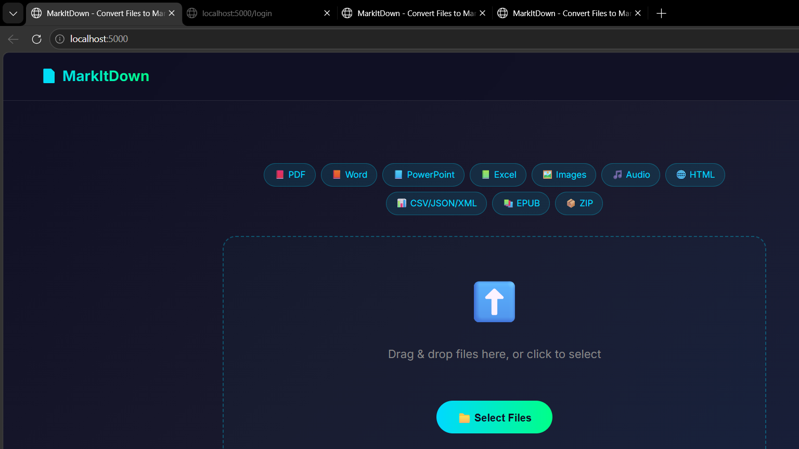
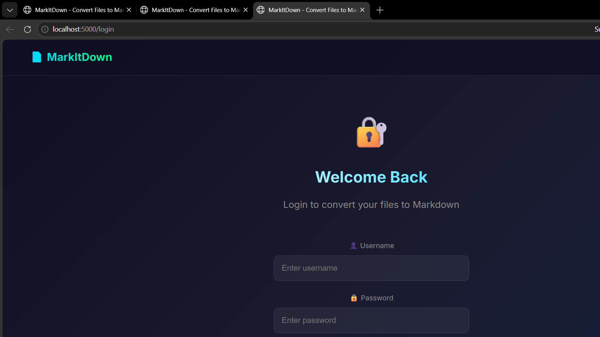
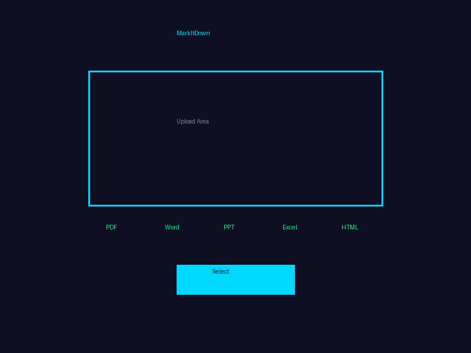
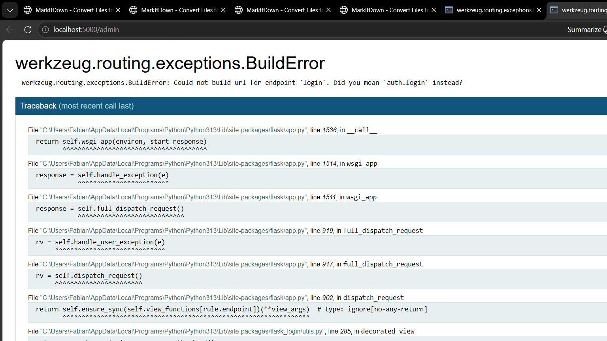

# 📄 MarkItDown

<p align="center">
  
  
  
</p>

> **A beautiful web application for converting various file formats to Markdown using Microsoft's MarkItDown library** ✨



## 🌟 Features

- **📕 PDF** - Convert PDF documents to Markdown
- **📙 Word** - Transform Word documents (.docx, .doc)
- **📘 PowerPoint** - Convert presentations (.pptx, .ppt)
- **📗 Excel** - Extract data from spreadsheets (.xlsx, .xls)
- **🖼️ Images** - Extract EXIF metadata
- **🎵 Audio** - Extract audio metadata
- **🌐 HTML** - Convert web pages
- **📊 Data Formats** - CSV, JSON, XML
- **📚 EPUB** - E-book conversion
- **📦 ZIP** - Batch file processing
- **User Management** - Admin approval system
- **Conversion History** - Track all conversions
- **Modern UI** - Dark theme with emojis 😎

## 🚀 Quick Start

### Docker (Recommended) 🐳

```bash
# Clone or download the project
git clone https://github.com/Ferns1992/markitdown-app.git
cd markitdown-app

# Build and run with Docker Compose
docker-compose up -d --build

# Access at http://localhost:5000
```

### Manual Installation 💻

```bash
# Create virtual environment
python -m venv .venv
source .venv/bin/activate  # Linux/Mac
# or .venv\Scripts\activate  # Windows

# Install dependencies
pip install -r requirements.txt

# Run the app
python run.py

# Access at http://localhost:5000
```

## 🔐 Demo Login

| Role | Username | Password |
|------|---------|---------|
| **Admin** | `admin` | `admin` |

### Default Admin Credentials
```
Username: admin
Password: admin
```

> ⚠️ **Important:** Change the admin password in production!

## 📁 Project Structure

```
markitdown-app/
├── app/
│   ├── __init__.py          # Flask app factory
│   ├── models.py            # Database models
│   ├── routes.py           # Main routes (upload, history)
│   ├── auth.py            # Authentication routes
│   └── templates/
│       ├── base.html     # Base template
│       ├── index.html    # Upload page
│       ├── login.html    # Login page
│       ├── register.html # Register page
│       ├── history.html  # History page
│       └── admin.html   # Admin panel
├── assets/
│   └── preview.png       # Preview image
├── Dockerfile          # Production Docker
├── Dockerfile.dev    # Development Docker
├── docker-compose.yml # Docker Compose
├── requirements.txt # Python dependencies
├── run.py          # Entry point
└── README.md       # This file
```

## 🐳 Docker Deployment

### Prerequisites
- Docker installed
- Docker Compose (optional)

### Deploy Options

#### Option 1: Docker Compose (Easiest) ✨

```bash
# Build and start
docker-compose up -d --build

# View logs
docker-compose logs -f

# Stop
docker-compose down
```

#### Option 2: Manual Docker Build

```bash
# Build image
docker build -t markitdown:latest .

# Run container
docker run -d -p 5000:5000 --name markitdown markitdown:latest
```

#### Option 3: Production with Gunicorn

```bash
# Build production image
docker build -f Dockerfile.prod -t markitdown:prod .

# Run with gunicorn
docker run -d -p 5000:5000 --name markitdown markitdown:prod
```

### Environment Variables

| Variable | Description | Default |
|----------|-------------|---------|
| `SECRET_KEY` | Flask secret key | Change in production |
| `DATABASE_URL` | Database URL | `sqlite:///markitdown.db` |

### Production Reverse Proxy (Nginx) 🌐

```nginx
server {
    listen 80;
    server_name yourdomain.com;

    location / {
        proxy_pass http://127.0.0.1:5000;
        proxy_set_header Host $host;
        proxy_set_header X-Real-IP $remote_addr;
    }
}
```

## 👥 User Management

### Admin Features
1. **Approve/Reject** new user registrations ✅❌
2. **View all users** and their status 👥
3. **Monitor conversions** history 📋

### User Flow
```
1. User registers → Status: Pending ⏳
2. Admin approves → Status: Approved ✅
3. User can login and convert files 🎉
```

## 🎨 UI Preview

### Login Page 🔐


### Upload Interface ⬆️


### Conversion Result ✅


### Admin Panel ⚙️


## 🔧 API Endpoints

| Endpoint | Method | Description |
|----------|--------|-------------|
| `/` | GET | Home page |
| `/login` | GET/POST | Login |
| `/register` | GET/POST | Register |
| `/logout` | GET | Logout |
| `/upload` | POST | Upload file |
| `/history` | GET | Conversion history |
| `/admin` | GET | Admin panel |

## 🛠️ Technology Stack

- **Backend:** Flask 3.1+ 🐍
- **Database:** SQLite (can be changed to PostgreSQL) 🗄️
- **Authentication:** Flask-Login + Flask-Bcrypt 🔐
- **File Conversion:** MarkItDown (Microsoft) 📄
- **Frontend:** HTML5 + CSS3 + JavaScript 🎨
- **Container:** Docker 🐳

## 📦 Supported File Formats

| Format | Extension | Status |
|--------|----------|--------|
| PDF | .pdf | ✅ |
| Word | .docx, .doc | ✅ |
| PowerPoint | .pptx, .ppt | ✅ |
| Excel | .xlsx, .xls | ✅ |
| Images | .jpg, .png, .gif | ✅ |
| Audio | .wav, .mp3 | ✅ |
| HTML | .html | ✅ |
| CSV | .csv | ✅ |
| JSON | .json | ✅ |
| XML | .xml | ✅ |
| EPUB | .epub | ✅ |
| ZIP | .zip | ✅ |

## 🤝 Contributing

1. Fork the repository 🍴
2. Create a feature branch 🌿
3. Make your changes ✏️
4. Submit a pull request 📥

## 📄 License

MIT License - See [LICENSE](LICENSE)

## 🙏 Credits

- [MarkItDown](https://github.com/microsoft/markitdown) by Microsoft
- Flask and the Flask ecosystem

---

<p align="center">
  Made with ❤️ | Deploy with 🚀
</p>